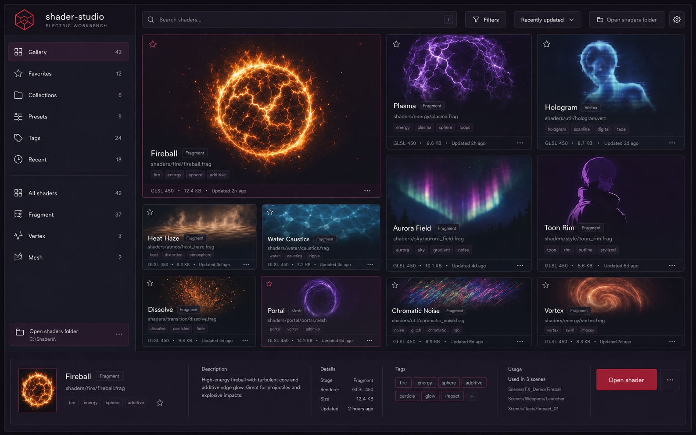

# Design System: shader-studio

## Overview

**Creative North Star: "The Electric Workbench"**

shader-studio is a calm professional instrument with an electric edge. The rendered shader is always the brightest, most expressive object in the room; the surrounding interface is compact, dark, precise, and quiet enough to disappear during focused work. Mulberry surfaces create a distinct environment without turning the product into a themed spectacle.

This is the MVP design target. The existing interface implements only part of it, so the tokens above are normative for new work and should replace one-off values as touched. The visual system takes ComfyUI Desktop's personality, Rive's approachability, PlayCanvas's durable workspace structure, and Shadertoy's visual discovery model without copying their feature metaphors.

The system explicitly rejects the generic SaaS dashboard, dense Blender or Unity cockpit, RGB-gamer cyberpunk interface, and bubbly creative toy. Familiar controls and disciplined density make the tool trustworthy; focused color, a distinctive mark, and polished feedback make it memorable.

**Key Characteristics:**

- Canvas-first layouts with compact, contextual chrome.
- Dark mulberry tonal layers rather than decorative containers.
- Signal Red for decisive interaction; Deep Berry for quiet active-state structure; Hot Coral for tiny signature moments.
- Refined, minimally curved geometry with a 12px absolute ceiling.
- Fast state motion and carefully layered elevation only where an element truly lifts.

**The Content-Is-Light Rule.** Shader output supplies the spectacle. Application surfaces never compete with it through decorative gradients, glow fields, or ornamental animation.

## Colors

The palette is restrained and dark: a mulberry architecture derived from `#2D132C`, deep berry active fields, and a controlled red-to-coral signal scale. The accents stay rare enough for shader output to remain the visual focus.

### Primary

- **Signal Red** (`primary`): filled primary actions, restrained one-pixel selection/focus outlines, and decisive interaction feedback.
- **Pressed Signal** (`primary-hover`): hover and pressed treatment for filled Signal Red controls.
- **Signal Edge** (`primary-text`): UI-component focus rings and compact active indicators. It is not body-copy color.

### Secondary

- **Deep Berry** (`selected`): selected navigation, broad active surfaces, completed range tracks, checkbox fills, and other quiet structural state. It carries active chrome without shouting.
- **Hot Coral** (`signature`): a tiny brand-mark spark only. It is forbidden on status dots, range tracks, checkbox fills, input borders, card borders, toggle tracks, view toggles, or large surfaces.

### Neutral

- **Mulberry Canvas** (`background`): the application frame and deepest persistent chrome.
- **Mulberry Surface** (`surface`): inspectors, toolbars, and static panels.
- **Raised Mulberry** (`surface-raised`): cards, nested control groups, and elevated tonal separation.
- **Overlay Mulberry** (`surface-overlay`): transient menus, command search, and floating inspectors.
- **Quiet Edge** (`border`): one-pixel structural dividers and input outlines.
- **Workbench Ink** (`ink`): primary text and icons.
- **Muted Ink** (`ink-muted`): secondary descriptions and metadata.
- **Subtle Ink** (`ink-subtle`): disabled and tertiary text; never place it on anything lighter than Raised Plum.
- **Viewport Black** (`viewport`): neutral surround for shader rendering so preview color is not contaminated by the brand surface.

**The Berry-Structures Rule.** Deep Berry carries broad selected surfaces, completed tracks, checkbox fills, and persistent active destinations. Use Signal Red only where decisive interaction needs a sharper edge.

**The Coral-Sparks Rule.** Hot Coral is a tiny brand-mark spark. It never becomes operational status, structural chrome, or a large-area fill.

**The Contrast Rule.** Body and placeholder text must maintain at least 4.5:1 contrast against their surface. Use Porcelain Ink or Dusty Rose Ink for ordinary text; Signal Red is a control fill and focus color, not body copy.

## Typography

**Display Font:** system UI sans-serif
**Body Font:** system UI sans-serif
**Label/Mono Font:** system UI sans-serif with native UI monospace for paths, uniform names, and numeric values

**Character:** One familiar sans family keeps the product approachable and fast across platforms. Weight, spacing, and alignment create hierarchy; novelty belongs to the mark and rendered work, not to UI labels.

### Hierarchy

- **Display** (650, 1.5rem, 1.15): gallery title, empty-state title, and rare top-level headings.
- **Headline** (650, 1.25rem, 1.2): shader titles and major inspector headings.
- **Title** (600, 1rem, 1.3): panel and group titles.
- **Body** (400, 0.9375rem, 1.5): instructions and descriptive copy, capped at 70ch.
- **Label** (550, 0.8125rem, 0.01em): controls, buttons, navigation, and metadata. Sentence case is the default.
- **Mono** (500, 0.8125rem, 1.4): file paths, GLSL uniform names, tags that reflect source identifiers, and tabular numeric values.

**The Instrument Type Rule.** Labels remain compact and familiar. Do not use a display face, excessive tracking, or uppercase section kickers to manufacture personality.

## Elevation

Static structure is flat and separated through tonal layering: Background to Surface to Raised Surface. Shadows appear only when a menu, command surface, popover, or dragged item physically leaves that structure. Elevated surfaces do not also receive a decorative border.

### Shadow Vocabulary

- **Lifted control** (`0 1px 2px rgba(0,0,0,0.34), 0 5px 14px rgba(0,0,0,0.18), 0 16px 40px rgba(0,0,0,0.10)`): compact dropdowns and dragged tiles. A tight contact shadow anchors the element while two broad, faded layers create soft lift.
- **Workbench overlay** (`0 1px 2px rgba(0,0,0,0.46), 0 8px 24px rgba(0,0,0,0.24), 0 24px 64px rgba(0,0,0,0.16)`): command search, dialogs, and large transient inspectors. Use no ornamental border.

**The Contact-First Rule.** Every elevated surface begins with a tight one-to-two-pixel contact shadow, then fades through broader, lighter layers. A single dark floating shadow is forbidden.

**The Flat-at-Rest Rule.** Gallery tiles, inspectors, toolbars, and controls do not float by default. If everything casts a shadow, nothing has hierarchy.

## Gallery Layout

The Gallery follows the **Preview Atlas** topology. A persistent discovery rail anchors the left edge; the top command band holds global search, filtering, sorting, folder access, and settings. The preview field uses a disciplined asymmetric grid: one large featured shader establishes the primary visual target, medium supporting previews preserve comparison, and smaller tiles increase scan density without becoming a uniform dashboard grid. A compact selected-shader detail strip spans the bottom and provides metadata, usage context, tags, and the single decisive **Open shader** action.

- **Featured preview:** the selected or most relevant shader occupies the largest atlas cell and wins the squint test.
- **Supporting mosaic:** medium and small live previews align to a shared 12-column grid; asymmetry may vary size, never alignment quality.
- **Discovery rail:** Gallery, Favorites, Collections, Presets, Tags, Recent, and harness shortcuts remain compact and count-aware. **Open shaders folder** stays a secondary utility.
- **Command band:** search is visually first; filters and sorting remain subordinate; no editable shader controls appear in the Gallery.
- **Detail strip:** selection exposes title, path, harness, renderer/version, size, tags, usage, favorite state, and **Open shader** without turning the Gallery into the Studio.
- **Selection:** quiet Deep Berry edge/tint only. Signal Red belongs to the final open action or keyboard focus, not selected-card decoration.
- **Density:** target 8–12 visible live previews at a 16:10 desktop workspace while keeping names and compact metadata legible.

## Components

Components are compact, tactile, precise, and familiar. Controls use restrained corner curves and direct state changes; no static control should look inflated, glassy, or toy-like.

### Buttons

- **Shape:** a precise 6px radius and 36px default height. Icon-only buttons are square, not circular, unless the symbol represents a directional handle.
- **Primary:** Signal Red fill with Porcelain Ink text and 8px 14px padding.
- **Hover / Focus:** deepen to Pressed Signal over 180ms; use a 2px Signal Red focus ring with 2px separation. Active state may translate by 1px but never bounce.
- **Secondary / Ghost:** Raised Mulberry or transparent background with Quiet Edge structure. Ghost controls gain a Raised Mulberry background on hover.

### Chips

- **Style:** compact rectangular filters with a 6px radius, Raised Mulberry background, and Dusty Rose Ink text. Chips do not use exaggerated pill geometry.
- **State:** selected chips use a restrained one-pixel Signal Red outline or Deep Berry fill with Porcelain Ink text; a checkmark or state icon accompanies color when ambiguity is possible.

### Cards / Containers

- **Corner Style:** 8px for shader tiles, 10px for persistent panels, and 12px only for transient overlays.
- **Background:** Mulberry Surface for panels; Viewport Black for render tiles.
- **Shadow Strategy:** flat at rest. Only transient or actively dragged surfaces use the Elevation vocabulary.
- **Border:** one-pixel Quiet Edge only where tonal separation is insufficient. Never combine it decoratively with a broad shadow.
- **Internal Padding:** 12px for compact tiles and 16px for panels.

### Inputs / Fields

- **Style:** Mulberry Surface fill, one-pixel Quiet Edge outline, 6px radius, and a 36px default height.
- **Focus:** use a restrained Signal Red outline and separated 2px ring. Focus is crisp, not glowy.
- **Error / Disabled:** pair semantic iconography and plain-language text with color. Disabled controls use Subtle Ink but remain legible.
- **Ranges:** Deep Berry fills the completed track; the remaining track uses Quiet Edge. A small solid Signal Red thumb is permitted with no white ring, halo, or glow. Values use tabular numerals. Hot Coral never appears on the track.

### Navigation

- **Style:** compact icon-and-label navigation on Mulberry Canvas. Active items use a Deep Berry field with Porcelain Ink; hover uses Mulberry Surface. Keep persistent navigation flat and structurally separated.
- **Responsive behavior:** below 720px, move the inspector beneath the viewport and expose secondary navigation through a standard menu or disclosure. Never shrink labels into illegibility.
- **Motion:** use 180ms state transitions with `cubic-bezier(0.22, 1, 0.36, 1)`. Reduced-motion mode removes translation and uses immediate state changes or a short crossfade.

### Shader Preview Tile

The preview occupies most of the tile. Name, harness type, and tags sit in a compact metadata strip rather than overlaying the shader. Hover reveals only immediately useful actions; selection uses a quiet one-pixel Deep Berry outline plus an optional Deep Berry surface tint. Hot Coral never appears as tile chrome or status.

### Command Search

Search is the fastest route into a growing shader collection. It uses the 12px overlay radius, Workbench Overlay shadow, a large direct input, keyboard-first result navigation, and grouped results by shader, tag, or path. Results emphasize live preview and matching text rather than decorative cards.

## Do's and Don'ts

### Do:

- **Do** let live shader previews carry most of the screen's color and visual energy.
- **Do** use Deep Berry for broad active structure and routine statuses, Signal Red for decisive interaction, and Hot Coral only as a tiny brand-mark spark.
- **Do** keep controls at 6px, tiles at 8px, panels at 10px, and overlays at no more than 12px radius.
- **Do** use tonal layering for static structure and the layered contact-first shadows only for genuine lift.
- **Do** make gallery search, tags, filters, and keyboard navigation first-class as the collection grows.
- **Do** preserve at least 4.5:1 text contrast, visible focus, reduced motion, and color-independent state cues.

### Don't:

- **Don't** turn the interface into a generic SaaS dashboard.
- **Don't** reproduce a dense Blender or Unity cockpit; reveal specialist controls contextually.
- **Don't** use an RGB-gamer cyberpunk interface or spread saturated accents across inactive states.
- **Don't** make controls feel like a bubbly creative toy through oversized pills or extreme curves.
- **Don't** use hazy low-contrast treatments, decorative marketing-page scaffolding, or effects that compete with the shader being evaluated.
- **Don't** use gradient text, decorative grid backgrounds, repeating stripe backgrounds, or glassmorphism as a default material.
- **Don't** use colored side-stripe borders, cards above 12px radius, or a one-pixel border paired decoratively with a broad shadow.
- **Don't** animate page-load choreography or gate content visibility behind reveal animations.
