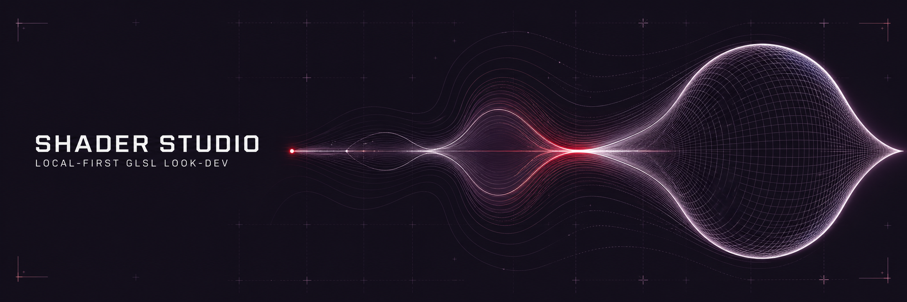

# Shader Studio



A **local-first gallery + development studio for WebGL shaders** — a look-dev sandbox for quickly iterating on effects destined for games (Unreal Engine 5/6) and websites.

You edit GLSL in your own editor; the running studio hot-reloads it in place, with live-tweakable uniform controls and an orbitable 3D camera. (An on-canvas compile-error overlay is the next planned piece — see [PLAN.md](PLAN.md).)

**Status: MVP in progress.** [PLAN.md](PLAN.md) has what's next; [CHANGELOG.md](CHANGELOG.md) has history.

## Quick start

```sh
pnpm install
pnpm dev --open
```

## Using it

The front page is the **gallery**: live previews of every entry under `shaders/`, all rendered from one shared WebGL context. It has search (inline or ⌘K overlay), tag and harness filters, and favorites and recents. Selecting a tile opens a detail strip; **Open shader** jumps into the studio.

The **studio** (`/shader/<slug>`) is where you work on a single shader:

- **Live canvas with hot reload** — save the `.glsl` file in your editor and it updates in place.
- **Uniform panel** auto-generated from the entry's `meta.json` — sliders, color pickers, all live.
- **Orbit camera + geometry switcher** for mesh shaders.
- **Custom-scene toggle** when the entry ships its own `Scene.svelte`.

## Adding a shader

A shader is just a folder under `shaders/` — drop one in and it appears in the gallery; there's no registry to update:

```
shaders/my-effect/
├── fragment.glsl    # required
├── vertex.glsl      # optional
├── meta.json        # declares uniforms → auto-generates the control panel
├── notes.md         # optional — e.g. UE porting notes
└── Scene.svelte     # optional — custom Threlte geometry
```

Entries render in one of three **harness modes**: fullscreen quad (Shadertoy-style), mesh primitive, or a custom scene component that receives the compiled material as a prop.

## Under the hood

- **Stack:** SvelteKit + Vite + TypeScript; Three.js via [Threlte](https://threlte.xyz/).
- **UI:** Tailwind v4 + shadcn-svelte, themed by [DESIGN.md](DESIGN.md)'s tokens.
- **Shaders are raw, portable GLSL** (`RawShaderMaterial`) — no Three-specific material plumbing, so effects port cleanly elsewhere.

## Repo map

| Path                                          | What                                                                                    |
| --------------------------------------------- | --------------------------------------------------------------------------------------- |
| [AGENTS.md](AGENTS.md)                        | How to work here: conventions, sources-of-truth map (canonical; `CLAUDE.md` imports it) |
| [PLAN.md](PLAN.md) / [backlog.md](backlog.md) | Committed next items / deferred tickets                                                 |
| [CHANGELOG.md](CHANGELOG.md)                  | Dated history                                                                           |
| [CONTEXT.md](CONTEXT.md)                      | Glossary of canonical terms                                                             |
| [docs/design/](docs/design/)                  | Design log (decisions `Dn`, the _why_) + synthesis (the _now_)                          |
| [docs/adr/](docs/adr/)                        | Architectural decision records (promoted from the log)                                  |
| [docs/tech-debt.md](docs/tech-debt.md)        | Deferred chores                                                                         |
| `shaders/`                                    | Shader entries — one folder each                                                        |

---

_Derived doc: this file describes the code; on conflict, code wins — fix this file._
